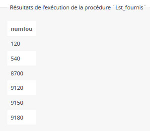
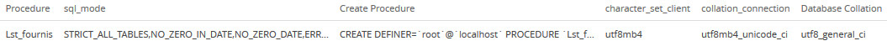
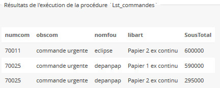

## Procédures stockées : corrigés

> Base de données: _papyrus_.

## Requêtes utiles

* Lister les procédures stockées : `SHOW PROCEDURE STATUS;`
* Supprimer une procédure : `DROP PROCEDURE nom_procedure;`

## Exercice 1 : Création d'une procédure stockée sans paramètre

* Créez la procédure stockée **Lst_fournis** correspondant à la requête n°2 afficher le code des fournisseurs pour lesquels une commande a été passée. 

        -- Modifie le délimiteur
		DELIMITER $$

        -- Ligne optionnelle
		DROP PROCEDURE IF EXISTS Lst_fournis $$

		CREATE PROCEDURE Lst_fournis()  
	
		BEGIN
  			SELECT f.numfou
			FROM fournis f
			JOIN entcom e ON e.numfou = f.numfou
			GROUP BY f.numfou
		END $$

        -- Rétablit le délimiteur d'origine
		DELIMITER ;

* Exécutez-la pour vérifier qu'elle fonctionne conformément à votre attente.  

		CALL Lst_fournis();

  **Résultat** _(peut varier selon votre jeu de données)_ : 

    
  
* Exécutez la commande SQL suivante pour obtenir des informations sur cette procédure stockée : 

		SHOW CREATE PROCEDURE nom_procedure;

   **Résultat**

     

## Exercice 2 : Création d'une procédure stockée avec un paramètre en entrée

Créer la procédure stockée **Lst_Commandes**, qui liste les commandes ayant un libellé particulier dans le champ `obscom` (cette requête sera construite à partir de la requête n°11). 

    DELIMITER $$
	
	DROP PROCEDURE IF EXISTS Lst_Commandes$$
	    
	CREATE PROCEDURE Lst_Commandes(IN p_libelle VARCHAR(50))  

	BEGIN
		SELECT e.numcom, 
               e.obscom, 
               f.nomfou, 
               p.libart, 
               l.qtecde*l.priuni AS SousTotal
		FROM entcom e
		JOIN fournis f ON e.numfou = f.numfou
		JOIN ligcom l ON l.numcom = e.numcom
		JOIN produit p ON p.codart = l.codart
	    WHERE e.obscom = p_libelle;
    END$$

    DELIMITER ;

**Exécution** 

	CALL Lst_Commandes('commande urgente');  

> On pourrait vouloir effectuer des recherches partielles sur les valeurs. Pour cela, remplacer le `WHERE` par ` WHERE e.obscom LIKE p_libelle`, il sera alors possible de passer des valeurs telles que `%urgent` en paramètre. 

**Résultat** _(peut varier selon votre jeu de données)_ : 

  

## Exercice 3 : Création d'une procédure stockée avec plusieurs paramètres

Créer la procédure stockée **CA_Fournisseur**, qui pour un code fournisseur et une année entrée en paramètres, calcule et restitue le CA potentiel de ce fournisseur pour l'année souhaitée (cette requête sera construite à partir de la requête n°19). 

On exécutera la requête que si le code fournisseur est valide, c'est-à-dire dans la table _FOURNIS_. 

	DELIMITER $$

    DROP PROCEDURE IF EXISTS CA_Fournisseur$$  
	
	CREATE PROCEDURE CA_Fournisseur(IN p_numfou VARCHAR(25), IN p_annee SMALLINT(4))  

	BEGIN
	   SELECT f.numfou,
              DISTINCT(f.nomfou), 
              SUM(l.qtecde * l.priuni * 1.2) AS CA
       FROM fournis f
       JOIN entcom e ON e.numfou = f.numfou
	   JOIN ligcom l ON l.numcom = e.numcom
       WHERE f.numfou = p_numfou
	   GROUP BY f.numfou, f.nomfou, e.datcom 
	   HAVING YEAR(e.datcom) = p_annee;
	END$$

    DELIMITER ;

Testez cette procédure avec différentes valeurs de paramètres.

Exemple : numfou = 120 et année = 2007. 