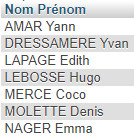
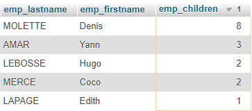
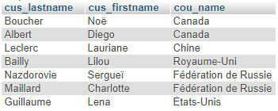
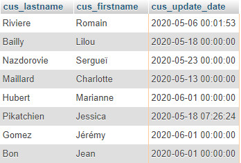
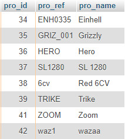
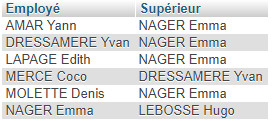
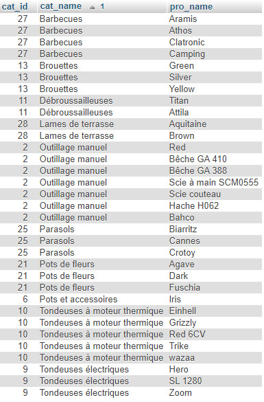
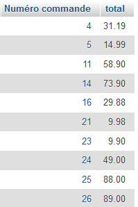

# Cas Gescom : les requêtes

## CORRIGES

Q1. Afficher les noms et prénoms des employés dans l'ordre alphabétique et sur une seule colonne nommée "Nom Prénom" 

=> utilisation de CONCAT requise

	SELECT CONCAT(emp_lastname, ' ', emp_firstname) AS "Nom Prénom" 
    FROM employees
    ORDER BY emp_lastname 

> Résultat :

Q2. Afficher les noms, prénoms et nombre d'enfants des employés qui ont des enfants, présenter d'abord par ceux qui en ont le plus.

	SELECT emp_lastname, emp_firstname, emp_children 
    FROM employees
    WHERE emp_children > 0
    ORDER BY emp_children DESC 

> Résultat :

Q3. Y-a-t-il des clients étrangers ? Afficher leur nom, prénom et le nom du pays de résidence.

	SELECT cus_lastname, cus_firstname, cou_name 
    FROM customers 
    JOIN countries ON cou_id = cus_countries_id 
    WHERE cus_countries_id != 'FR'

> Résultat :

Q4. Afficher les clients dont les fiches ont été modifiées.

	SELECT cus_lastname, cus_firstname, cus_update_date 
    FROM customers 
    WHERE cus_update_date 
    IS NOT NULL

> Résultat :

Q5. La commerciale Coco Merce veut consulter la fiche d'un client, mais son seul souvenir est qu'il habite une ville genre 'divos'. Pouvez-vous l'aider ?  

	SELECT *  
	FROM customers
    WHERE cus_city LIKE '%divos%'

> Résultat : client 12, Nazdorovie Sergueï qui habite à Vladivostok.

Q6. Quel est le produit dont le prix catalogue est le moins cher ?

+++ COHERENCE : MODIFIER LE PRODUIT DONT LE PRIX EST LE MOINS CHER, ICI UN BARBECUE A 1.20 !!! +++

	SELECT MIN(pro_price), pro_id, pro_ref, pro_ean, pro_name  
	FROM products

> Résultat : pro_id = 7, barbecue Aramis. 

Q7. Afficher les produits commandés par Jessica Pikatchien.

	SELECT p.pro_id, pro_ref, pro_name, c.cus_id, o.ord_id, od.ode_id  
	FROM products p
	JOIN orders_details od ON od.ode_pro_id = p.pro_id
	JOIN orders o ON o.ord_id = od.ode_ord_id 
	JOIN customers c ON cus_id = ord_cus_id
	WHERE c.cus_lastname = 'PIKATCHIEN'
	AND c.cus_firstname = 'Jessica'

> Résultat :

Q8. Lister les produits qui n'ont jamais été vendus.

=> sous-requête avec NOT IN

	SELECT pro_id, pro_ref, pro_name 
    FROM products 
    WHERE pro_id NOT IN (SELECT ode_pro_id FROM orders_details) 

> Résultat : produits 34 à 42, sauf le 40.

Q9. Afficher l'organigramme hiérarchique de l'entreprise

	SELECT CONCAT(e1.emp_lastname, ' ', e1.emp_firstname) AS 'Employé', 
           CONCAT(e2.emp_lastname, ' ', e2.emp_firstname) AS 'Supérieur' 
    FROM employees e1
    JOIN employees e2 ON e2.emp_id = e1.emp_superior_id
    ORDER BY e1.emp_lastname

> Résultat : 

Q10. Afficher le catalogue des produits par catégorie, le nom des produits et de la catégorie doivent être affichés.

	SELECT cat_id, cat_name, pro_name 
    FROM products 
    JOIN categories ON cat_id = pro_cat_id 
    ORDER BY cat_name

> Résultat :

Q11. Quel produit a reçu la remise la plus élevée ?

	SELECT p.pro_id, p.pro_name, MAX(od.ode_discount) AS 'Remise', od.ode_id
    FROM products p
    JOIN orders_details od ON od.ode_pro_id = p.pro_id

> Résultat :

 

Q12. Lister les commandes dont le total est inférieur à 100 €.

+++ Avec prise en compte de la remise +++

    SELECT ode_ord_id, SUM((ode_unit_price - (ode_unit_price*ode_discount)/100) * ode_quantity) AS total
	FROM orders_details
	GROUP BY ode_ord_id  
    HAVING total < 100
    ORDER BY total

> Résultat : 3ères lignes (< 10 €) : ord_id 21, 23 et 96. 

> Résultat (10 premières lignes sur 26) :

 

Q13. Combien y-a-t-il de clients canadiens ? Afficher dans une colonne intitulée 'Nb clients Canada' 

	SELECT count(*) AS 'Nb clients Canada' 
    FROM customers 
    WHERE cus_countries_id = 'CA'

> Résultat : 2 clients (customers.cus_id : 10 et 24)

Q14. Quel produit marche le mieux ?

=> il fallait comprendre quel est le produit vendu en plus grand nombre 

	SELECT COUNT(od.ode_pro_id) AS nb_vendus, p.pro_name, p.pro_id 
    FROM orders_details od 
    JOIN products p ON p.pro_id = ode_pro_id

> Résultat : pro_id = 7, 100 unités vendues. 

Q15. Quelle est la plus grande quantité commandée pour un seul produit et quel est ce produit ?   

+++ TODO +++ 	

Q16. Afficher le détail des commandes de 2020.

	SELECT od.*, o.ord_order_date 
    FROM orders_details od
    JOIN orders o ON o.ord_id = od.ode_ord_id
    WHERE YEAR(o.ord_order_date) = '2020'
    ORDER BY od.ode_ord_id
	
> Résultat :

 

Q17. Afficher les coordonnées des fournisseurs pour lesquels des commandes ont été passées.

	SELECT s.*
	FROM orders_details od 
	JOIN products p ON p.pro_id = od.ode_pro_id 
	JOIN suppliers s ON s.sup_id = p.pro_sup_id
	GROUP BY s.sup_id

> Résultat : tous les fournisseurs !

Q18. Quel est le chiffre d'affaires de 2020 ?
	
	SELECT SUM((ode_unit_price - (ode_unit_price*ode_discount)/100) * ode_quantity)  AS 'Chiffre d\'affaires'
     FROM orders_details od 
    JOIN orders o ON o.ord_id = od.ode_ord_id
    WHERE YEAR(o.ord_order_date) = '2020'
    ORDER BY od.ode_ord_id 

> Résultat : 1575.77 €

Q19. Quel est le panier moyen ?

	SELECT AVG(panier_moyen.total) AS 'Panier moyen' 
    FROM 
		(SELECT od.ode_ord_id, SUM((ode_unit_price - (ode_unit_price*ode_discount)/100) * ode_quantity) AS total 
    	FROM orders_details od 
    	JOIN orders o ON o.ord_id = od.ode_ord_id 
    	GROUP BY od.ode_ord_id) AS panier_moyen
    
> Résultat : 235.093088235294 (+++ TODO à vérifier sur un jeu de 10 lignes de commandes +++)

Q20. Où le chiffre d'affaires à l'export est-il le plus élevé ?  

    +++ SANS PRISE EN COMPTE REMISE +++
	SELECT c.cus_countries_id, MAX(SUM(od.ode_unit_price * od.ode_quantity))
	FROM orders_details od 
    JOIN orders o ON o.ord_id = od.ode_ord_id 
    JOIN customers c ON c.cus_id = o.ord_cus_id 
    JOIN countries cou ON cou.cou_id = c.cus_countries_id 
    WHERE c.cus_countries_id != 'FR' 
    GROUP BY c.cus_countries_id 
 
	> Résultat : Russie, 891,34 +++ TODO, déduire remise +++

	+++ AVEC PRISE EN COMPTE REMISE +++
	SELECT c.cus_countries_id, MAX() AS 'CA max'
	FROM orders_details od 
    JOIN orders o ON o.ord_id = od.ode_ord_id 
    JOIN customers c ON c.cus_id = o.ord_cus_id 
    JOIN countries cou ON cou.cou_id = c.cus_countries_id 
    WHERE c.cus_countries_id != 'FR' 
    GROUP BY c.cus_countries_id 
 
	> Résultat : Russie, 891,34 +++ TODO, déduire remise +++

Q21. Lister le total de chaque commande par total décroissant (Afficher numéro de commande, date, total et nom du client).

+++ TODO +++	

> Résultat :

## LES BESOINS DE MISE A JOUR

Q22. La version 2020 du produit _barb004_ s'appelle désormais _Camper_ et, bonne nouvelle, son prix subit une baisse de 10%.

	UPDATE products 
    SET pro_name = 'Camper', pro_price = pro_price-(pro_price)*0.10 
    WHERE pro_ref = 'barb004'

=> produit 12, prix d'origine = 100 €, prix après baisse 90 €.

Q23. L'inflation en France en 2019 a été de 1,1%, appliquer cette augmentation à la gamme de parasols.

	UPDATE products 
    SET pro_price = pro_price+(pro_price*0.011) 
    WHERE pro_cat_id = 25

> Résultat : les produits 25 à 27 sont concernés. Prix d'origine du produit 25 : 100 €, prix après augmentation : 101,10 €.

Q24. Supprimer les produits non vendus de la catégorie "Tondeuses électriques" (ces produits sont : 36, 37 et 41 de la catégorie 9).

+++ TODO +++	

> Résultat :
 
